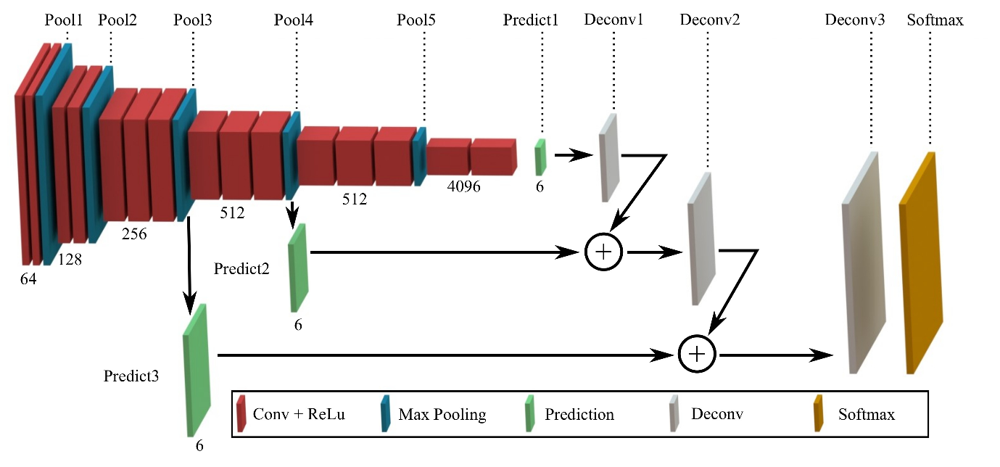

# Semantic Segmentation
### Introduction
In this project, you'll label the pixels of a road in images using a Fully Convolutional Network (FCN).

## Architecture / Rubic points

### Load pre-trained vgg model

Function ```load_vgg loads``` loads pre-trained vgg model.

### Learn the correct features from the images

The project has layers functions implemented. 



### Optimize the neural network

The ```optimize``` function for the network is cross-entropy, and an Adam optimizer is used. 

```python
    cross_entropy_loss = tf.reduce_mean(tf.nn.softmax_cross_entropy_with_logits(logits=logits, labels=labels))
    optimizer = tf.train.AdamOptimizer(learning_rate)
    train_op = optimizer.minimize(cross_entropy_loss)

```

### Train the neural network

The ```train_nn``` function is implemented and prints time and loss per epoch/epochs of training.

### Train the model correctly with reasonable hyper parameters

The project trains model correctly, about 48s per epoch, 48sx40 epochs in total.

Final hyperparamters used for training.

```python
    L2_REG = 1e-5
    STDEV = 1e-2
    KEEP_PROB = 0.8
    LEARNING_RATE = 1e-4
    EPOCHS = 40
    BATCH_SIZE = 8
    IMAGE_SHAPE_KITI = (160,576)
    NUM_CLASSES = 2
```

### Correctly labeling the road

Results from the test images. From the GIF below, A pre-trained VGG-16 network combined with a fully convolutional network will successfully label the road. Performance was also improved  through the use of skip connections and adding element-wise to upsampled lower-level layers.


### Setup
##### GPU
`main.py` will check to make sure you are using GPU - if you don't have a GPU on your system, you can use AWS or another cloud computing platform.
##### Frameworks and Packages
Make sure you have the following is installed:
 - [Python 3](https://www.python.org/)
 - [TensorFlow](https://www.tensorflow.org/)
 - [NumPy](http://www.numpy.org/)
 - [SciPy](https://www.scipy.org/)

You may also need [Python Image Library (PIL)](https://pillow.readthedocs.io/) for SciPy's `imresize` function.

##### Dataset
Download the [Kitti Road dataset](http://www.cvlibs.net/datasets/kitti/eval_road.php) from [here](http://www.cvlibs.net/download.php?file=data_road.zip).  Extract the dataset in the `data` folder.  This will create the folder `data_road` with all the training a test images.

### QuickStart

##### Run
Run the following command to run the project:
```
python main.py
```
**Note:** If running this in Jupyter Notebook system messages, such as those regarding test status, may appear in the terminal rather than the notebook.


### Submission
1. Ensure you've passed all the unit tests.
2. Ensure you pass all points on [the rubric](https://review.udacity.com/#!/rubrics/989/view).
3. Submit the following in a zip file.
 - `helper.py`
 - `main.py`
 - `project_tests.py`
 - Newest inference images from `runs` folder  (**all images from the most recent run**)
 
### Tips
- The link for the frozen `VGG16` model is hardcoded into `helper.py`.  The model can be found [here](https://s3-us-west-1.amazonaws.com/udacity-selfdrivingcar/vgg.zip).
- The model is not vanilla `VGG16`, but a fully convolutional version, which already contains the 1x1 convolutions to replace the fully connected layers. Please see this [post](https://s3-us-west-1.amazonaws.com/udacity-selfdrivingcar/forum_archive/Semantic_Segmentation_advice.pdf) for more information.  A summary of additional points, follow. 
- The original FCN-8s was trained in stages. The authors later uploaded a version that was trained all at once to their GitHub repo.  The version in the GitHub repo has one important difference: The outputs of pooling layers 3 and 4 are scaled before they are fed into the 1x1 convolutions.  As a result, some students have found that the model learns much better with the scaling layers included. The model may not converge substantially faster, but may reach a higher IoU and accuracy. 
- When adding l2-regularization, setting a regularizer in the arguments of the `tf.layers` is not enough. Regularization loss terms must be manually added to your loss function. otherwise regularization is not implemented.

